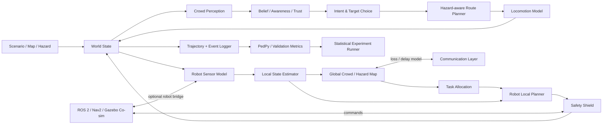

# 다중 로봇 개입 군중 대피 시뮬레이션의 설계·구현·검증 제안

## Executive Summary

첨부 문서의 현재 구현은 이미 단순한 “Social Force + 로봇” 수준을 넘어선다. 보행자에게 `unaware → cued → milling → acting`의 인지 상태, 위험에 대한 부분 기억, 로봇·위험·주변인으로부터의 정보 획득, 로봇 추종·이웃 추종·자기 판단의 행동 선택, 재진입 방지 로직이 있고, 이동은 Helbing 계열 Social Force와 navmesh로 구현되어 있다. 특히 재진입 문제를 명시적으로 발견하고 `_on_reentry`, `_release_from_robot`으로 수정한 것은 **검증을 통해 모델 결함을 찾아내고 고치는 올바른 연구 과정**에 가깝다. 반면 현재 검증 결과에서 1.2 m 병목 비유량이 문헌 기준의 약 15%, 3 m 병목도 약 55%에 그치고 역류 차선 형성이 재현되지 않는다는 점, 이웃 추종률 0.7·로봇 수락률 0.75·안전 이후 50/20/30 등의 파라미터에 직접적인 실증 근거가 없다는 점은 로봇 정책 연구 전에 해결해야 할 핵심 문제다. fileciteturn0file0

이 판단은 선행연구와도 일치한다. Social Force 계열은 보행자의 국소 상호작용을 표현하는 대표적인 미시 모델이고, Moussaïd 등의 인지적 휴리스틱은 시각적 정보로 방향·속도를 선택하는 대안을 제시한다. 반면 PADM(Protective Action Decision Model)은 위험 신호·사회적 신호·경고 메시지가 지각되고 해석된 뒤 보호 행동으로 이어지는 상위 의사결정을 설명한다. 따라서 **대피 모델 하나로 모든 층을 해결하려 하기보다, 인지·전술·이동을 계층적으로 분리하는 것이 이 프로젝트에 적합하다.** citeturn4search1turn13search26turn4search0

다중 로봇 연구에서 가장 가까운 직접 선행연구는 Zheng 등의 2024년 *IEEE Transactions on Control Systems Technology* 논문이다. 이 연구는 인간-로봇의 미시적 Social Force 상호작용과 군중 밀도·속도의 거시적 표현을 결합하고, 소수의 로봇이 많은 군중을 유도하도록 로봇의 국소 유도장을 실시간 군중 상태에 따라 조정한다. 이는 본 프로젝트에서 **“개별 보행자 시뮬레이션은 미시적으로 유지하되, 로봇의 의사결정에는 밀도·유량 같은 거시 상태를 이용한다”**는 구조를 채택해야 할 강한 근거다. citeturn15view0

제가 권고하는 최종 구조는 **하이브리드 계층형 모델**이다.

| 층 | 권고 모델 | 핵심 역할 |
|---|---|---|
| 위험·정보 지각 | 가시성/거리/센서 기반 확률 모델 | 위험·로봇·주변인 신호 관측 |
| 인지·의사결정 | PADM을 단순화한 상태/확률 모델 | 위협 인식, 신뢰, 대피 개시, 로봇 수락 |
| 전략/전술 | hazard-aware route utility / navmesh | 출구·경로·추종 대상 결정 |
| 운영 이동 | 보정된 Social Force 또는 Collision-Free Speed | 실제 보행, 충돌, 병목 흐름 |
| 사회적 상호작용 | 개인+그룹+정보전파 모델 | 이웃 추종보다 현실적인 사회 영향 |
| 로봇 개입 | 역할 기반 다중 로봇 + 계층형 분산 제어 | 탐색, 유도, 흐름 조절, 통신 중계 |
| 안전 계층 | 독립적인 로봇 collision/safety shield | 사람과의 최소거리·속도·접촉 제한 |
| 학습 계층 | 선택적 MARL/DRL | **모델 자체가 아니라 로봇 정책**을 학습 |

특히 **딥러닝을 군중 전체의 기본 행동 모델로 바로 사용하는 것은 권고하지 않는다.** Social-LSTM과 같은 데이터 기반 모델은 관측 궤적에서 사회적 상호작용을 학습할 수 있고, 실제 로봇 유도 실험으로 피난자의 움직임을 학습하는 연구도 가능하지만, 본 프로젝트의 핵심은 새로운 상황·맵·위험 조건에서 개입 정책을 비교하는 것이므로 설명 가능하고 외삽 가능한 규칙/인지 모델을 기본 모델로 두고 데이터 기반 모델은 비교군이나 국소 HRI 모델로 사용하는 것이 연구 정당화에 유리하다. citeturn13search0turn2search4

또 하나의 핵심 권고는 **“군중 시뮬레이션의 타당성”과 “로봇 정책의 성능”을 절대로 한 단계에서 검증하지 않는 것**이다. ISO 20414:2020은 복잡한 agent-based evacuation model일수록 구성 요소와 창발 행동을 별도로 검증할 필요성을 강조하며, 이 표준은 2026년 6월 체계 검토 후 다시 확인된 현행 국제표준이다. NIST TN 1822 역시 verification과 validation을 구분하고, 이동·경로·행동 전 시간·출구 사용·유량 제약 등을 구성 요소별로 살펴보는 접근을 제시한다. citeturn15view1turn0search0

따라서 개발의 우선순위는 다음이어야 한다.

| 우선순위 | 작업 | 완료 조건 |
|---|---|---|
| **P0** | 이동 계층과 시간적 해상도 수정 | 병목 유량·기본도·역류·코너 테스트가 실측 범위와 일치 |
| **P1** | 인지·행동 모델 재구성 | 임의 상수를 파라미터화하고 행동 로그·민감도 시험 가능 |
| **P2** | 단일 로봇 HRI 모델 | 수락률·신뢰·방향 충돌 효과를 별도 검증 |
| **P3** | 다중 로봇 역할·분산/계층 제어 | 로봇 수·통신 실패·센서 오차를 실험 가능 |
| **P4** | 대규모 정책 비교 | no-robot, heuristic, centralized, distributed 비교 |
| **P5** | MARL/DRL | P0–P4가 고정된 뒤에만 정책 학습 |
| **P6** | 외부 타당성 검증 | 미사용 데이터·새 맵·VR/소규모 HRI에서 결론 유지 |

즉, 이 프로젝트에서 가장 설득력 있는 논문 주장은 “우리 군중 모델이 현실을 완벽하게 예측한다”가 아니라, **“복수의 경험적 패턴에 맞게 검증된 군중 모델과 넓은 행동 불확실성 범위에서, 특정 다중 로봇 전략의 효과가 일관되게 유지된다”**가 되어야 한다. 패턴 중심 모델링은 단일 데이터셋에 맞춘 보정보다 여러 관찰 패턴을 동시에 재현하는 방식으로 모델 구조를 제약하는 접근을 제시하며, 군중 대피와 같이 완전한 ground truth를 확보하기 어려운 문제에 특히 적합하다. citeturn5search1

## 연구 목적·연구 질문·요구사항

**연구 목적.** 제안하는 시뮬레이터의 목적은 “로봇이 있는 대피 장면을 시각적으로 그럴듯하게 재현”하는 것이 아니라, **다중 이동 로봇의 정보 제공·유도·흐름 조절이 군중의 대피 효율과 안전에 언제, 얼마나, 어떤 조건에서 도움이 되는지를 반복 가능한 계산 실험으로 평가하는 것**이다. Zheng 등의 연구처럼 소수 로봇이 훨씬 큰 인구집단에 간접적으로 영향을 주는 문제가 핵심이므로, 사람 한 명 한 명의 반응과 동시에 밀도·유량 같은 집단 상태도 관찰해야 한다. citeturn15view0

이를 연구 질문으로 명시하면 다음과 같다.

**RQ1.** 다중 로봇 유도는 로봇이 없는 조건 및 단일 로봇 조건에 비해 `T50`, `T90`, `T95`와 위험 노출량을 유의하게 줄이는가?

**RQ2.** 로봇 수를 증가시켰을 때 효과가 단조 증가하는가, 아니면 로봇 간 간섭·군중 방해 때문에 포화점 또는 역효과가 존재하는가? Zheng 등도 사람 수·로봇 수·장애물 조건의 조합을 비교했으므로 이 문제는 직접적인 연구 확장점이 된다. citeturn15view0

**RQ3.** 중앙집중, 완전 분산, 계층형 하이브리드 제어 중 어느 구조가 정상 통신과 패킷 손실·지연·부분 센서 고장 상황에서 가장 좋은 성능-강건성 절충을 보이는가?

**RQ4.** 로봇의 효과는 사람의 로봇 수락 확률, 정보원 신뢰도, 주변 군중의 이동 방향, 위험의 감지 가능성, 행동 전 지연 등의 행동 가정에 얼마나 민감한가? 실제 HRI 연구에서는 비상시 로봇에 매우 높은 신뢰를 보이는 현상과 주변 군중이 로봇과 반대 방향으로 움직일 때의 충돌 효과가 모두 관찰되므로, 하나의 수락률 상수만으로 현실을 대표하기 어렵다. citeturn2search5turn3search8

**RQ5.** 로봇의 이득은 특정 Social Force 파라미터나 특정 맵에만 존재하는가, 아니면 서로 다른 이동 모델·밀도·맵·행동 파라미터에서도 결론이 유지되는가? Haghani와 Sarvi의 전 범위 민감도 연구는 특히 병목에서의 locomotion 관련 파라미터가 대피 결과를 크게 좌우할 수 있음을 보여주므로 이 질문이 중요하다. citeturn5search6

**RQ6.** 완전한 세계 상태를 알고 움직이는 “oracle robot”과 실제 센서·통신 제약을 가진 로봇 사이의 성능 격차는 얼마인가? 이 격차를 명시해야 로봇 알고리즘의 이득과 비현실적인 정보 가정의 이득을 분리할 수 있다.

**RQ7.** 평균 대피 시간의 개선이 고밀도 위험, 접촉, 근접사고, 재진입 또는 취약 집단의 대피 지연을 증가시키는 대가를 치르지는 않는가? 즉, 연구 목표를 단일 목적 `min evacuation time`이 아니라 **효율·안전·형평성의 다목적 문제**로 정의한다.

사용자가 이번 요청에서 구체적인 시스템 제약값을 정하지 않았으므로, 아래 표의 **“명시 제약”은 모두 ‘제약 없음’**으로 기록하는 것이 엄밀하다. 오른쪽의 값은 제약이 아니라 제가 권하는 첫 구현의 연구용 기본값이다.

| 요구사항 | 사용자 명시 제약 | 권고 연구용 기본값 | 근거/이유 |
|---|---|---|---|
| 환경 | **제약 없음** | 2D 도심 보행 공간, 100–300 m 규모 + 3–5개 소형 benchmark geometry | 기존 구현이 도시 야외 map/crop을 사용하므로 연속성이 높음. fileciteturn0file0 |
| 군중 규모 | **제약 없음** | 주 실험 500–5,000명, stress test 10,000명 이상 | 저밀도부터 국소 고밀도 병목까지 포함 |
| 로봇 수 | **제약 없음** | 0, 1, 2, 4, 8대; 필요시 crowd/robot 비율 추가 | 수 자체와 정책의 효과를 분리 |
| 로봇 유형 | **제약 없음** | 원형/차동구동 지상로봇부터 시작 | HRI·충돌 모델을 단순화 |
| 센서 | **제약 없음** | 이상적 ground-truth와 LiDAR/RGB-D/odometry 모델을 둘 다 제공 | 알고리즘 상한과 현실 성능의 차이를 측정 |
| 위험 센서 | **제약 없음** | 위치별 위험 강도/감지확률 + 로봇 hazard sensor | 현재 `perceptibility` 모델과 연결 |
| 통신 | **제약 없음** | 정상/지연/손실/완전 단절 모드 | 다중 로봇 강건성 검증 |
| 실시간성 | **제약 없음** | 연구 batch는 faster-than-real-time 우선, 별도 interactive mode | 연구 실험은 반복 횟수가 실시간 렌더링보다 중요 |
| 성능 | **제약 없음** | headless 대량 실행을 최우선 KPI로 설정 | 시드·민감도·정책 비교에 수천 회 실행 필요 |
| 물리 차원 | **제약 없음** | 군중은 2D, 로봇 센서 검증만 선택적으로 3D | 수천 명을 3D rigid-body로 시뮬레이션할 필요가 없음 |
| 위험 종류 | **제약 없음** | visible hazard + low-perceptibility hazard 두 계열 | 인지 모델의 효과를 분리하기 좋음 |
| 실제 로봇 연동 | **제약 없음** | 후반부 ROS 2 인터페이스 | 초기부터 ROS/Gazebo 의존성을 강제하지 않음 |

여기서 중요한 설계 결정은 **초기 전체 밀도와 병목 국소 밀도를 구분하는 것**이다. 현재 문서의 초기 배치는 약 0.04–0.05명/m²로 매우 희박한 도시 보행 상황을 대상으로 하지만, 로봇이 실질적으로 필요한 순간에는 병목이나 위험 경계에서 훨씬 높은 국소 밀도가 발생할 수 있다. 따라서 초기 평균 밀도 하나만 변화시키기보다 출입량, 목적지 분포, 병목 폭, 위험 확장으로 밀도 hotspot을 만들어야 한다. fileciteturn0file0

또한 한국 연구 맥락에서도 위험 감지와 실시간 경로선택을 결합한 대피 모델이 이미 제안되어 있다. 김현철·한순흥의 2018년 연구는 CFD 위험 정보와 인간 감각 기반 위험 감지, 병목을 고려한 실시간 능동 경로 선택을 Unity 기반 대피 시뮬레이션에 결합했다. 따라서 현재 모델에서 “위험 기억”을 단순 반발력에만 쓰기보다 **경로 비용 자체에 위험도를 포함시키는 방향**은 국내 연구와도 잘 연결된다. citeturn14view0

## 군중 행동 및 다중 로봇 상호작용 모델링

현재 구현의 좋은 부분은 `인지 → 목표 결정 → 이동`이 이미 분리되어 있다는 것이다. 이는 전면 재작성보다 **층별 인터페이스를 명시적으로 정리하는 refactoring**이 적합하다는 뜻이다. 다만 현재는 `which_goal_agent_want` 안에 로봇 수락, 이웃 추종, 평상시 이동, 대피 후 행동이 함께 얽혀 있으므로, 앞으로 정책을 비교할수록 원인을 추적하기 어려워질 가능성이 높다. fileciteturn0file0

**군중 행동 모델 후보 비교**

| 모델 계열 | 대표 아이디어 | 장점 | 약점 | 데이터 요구 | 이 연구 적합도 |
|---|---|---|---|---|---|
| **Social Force** | 목표 구동력 + 사람/벽 반발·접촉 | 연속공간, 로봇 힘과 결합 쉬움, 기존 코드 활용 가능 | 파라미터에 민감, 물리적 “힘”이 실제 심리 힘과 동일한 것은 아님, 잘못 보정하면 병목·역류 실패 | 중간 | **높음—운영층 후보** |
| **Collision-Free Speed / 속도 기반** | 간격에 따라 충돌을 피하는 속도 결정 | 비교적 적은 파라미터, collision-free 구조 | 심리·인지 계층을 별도 구현해야 함 | 중간 | **매우 높음—SF 대안/교차검증용** |
| **규칙/휴리스틱** | 보이는 장애물·사람을 보고 방향·속도 결정 | 행동 해석이 쉽고 실험 패턴과 연결 가능 | 복잡한 사회 행동은 규칙 증가 | 중간 | **높음** |
| **인지-행동/PADM 계열** | 신호 → 지각/주의 → 위협평가 → 행동 | 로봇 메시지·신뢰·정보전파를 자연스럽게 표현 | 파라미터 식별이 어렵고 데이터 부족 가능 | 높음 | **최상—전략/인지층** |
| **Cellular Automata / floor field** | 격자와 확률적 이동 규칙 | 매우 빠르고 대규모 계산 용이 | 연속 로봇 운동·개인 간 거리 표현에 불리 | 낮음~중간 | 보조 비교군 |
| **거시/CTM·유체 모델** | 밀도와 유량을 셀/연속장으로 모델링 | 초대규모·실시간 상태 추정에 강함 | 개별 로봇-HRI 묘사가 약함 | 낮음 | **로봇 global planner용으로 높음** |
| **딥러닝 궤적 모델** | 관측 궤적에서 미래 궤적 학습 | 복잡한 사회 패턴을 데이터에서 학습 | 훈련 분포 밖 조건, 인과 설명, safety constraint 검증이 어려움 | 매우 높음 | 비교/센서 예측용 |
| **RL/IRL 행동 모델** | reward/policy를 데이터 또는 상호작용에서 학습 | 복잡한 의사결정 표현 가능 | 보상 설계·식별·재현성과 검증 부담 | 매우 높음 | 후반 연구용 |
| **하이브리드** | 인지는 규칙/PADM, 경로는 utility, 보행은 SF/CFS | 층별 검증·교체 가능 | 구현 구조를 잘 설계해야 함 | 중간~높음 | **최종 권고** |

Social Force의 원전은 원하는 속도로의 가속과 사람·경계로부터의 상호작용을 이용해 보행 운동을 구성하며, Moussaïd 등의 모델은 시야 내 후보 방향과 충돌까지의 거리를 이용한 간단한 휴리스틱만으로 여러 보행 현상을 설명했다. 따라서 두 계열을 **서로 경쟁하는 전체 대피 모델**로 보기보다 “운영 이동층의 교체 가능한 두 구현”으로 보는 것이 적절하다. citeturn4search1turn13search26

인지층에서는 PADM이 더 유용하다. PADM은 환경적 단서, 사회적 단서, 경고 메시지가 바로 행동으로 이어지는 것이 아니라 여러 pre-decision 및 위협/보호행동 판단을 거친다고 본다. 현재의 `unaware → cued → milling → acting`은 이를 단순화한 형태로 해석할 수 있으므로, 상태 수를 무작정 늘리기보다 **각 전이가 어떤 관측·신뢰·위협 평가의 결과인지 명시하는 것**이 좋다. citeturn4search0

권고하는 보행자 내부 상태는 다음과 같다.

\[
s_i(t)=
\{x_i,v_i,\text{goal}_i,
b_i^H,
\tau_i^R,
k_i^{map},
g_i,
m_i^H,
a_i\}
\]

여기서 \(b_i^H\)는 위험에 대한 belief, \(\tau_i^R\)는 로봇 또는 로봇 시스템에 대한 신뢰, \(k_i^{map}\)은 공간지식, \(g_i\)는 동행 그룹, \(m_i^H\)는 기억한 위험 정보, \(a_i\)는 awareness/decision state이다. **실제 위험 영역 자체를 보행자 상태에 넣지 않는 것**이 중요하다. 보행자는 ground truth가 아니라 자신의 관측과 기억만으로 행동해야 한다.

현재 가장 먼저 수정해야 하는 전술층은 위험 경로 비용이다. 현 구현의 “목적지가 위험 지점에서 멀면 안전”이라는 조건은 navmesh 경로가 위험지대를 가로지를 수 있다는 문제가 이미 재진입 현상으로 드러났다. fileciteturn0file0 권고 비용은 예를 들어

\[
C_i(P)=
w_L L(P)
+w_H\int_P \hat H_i(x,t)\,dx
+w_\rho\int_P \hat \rho_i(x,t)\,dx
+w_C C_{\text{counterflow}}
+w_U C_{\text{unknown}}
+w_S C_{\text{switch}}
\]

로 구성한다. \(C_{\text{switch}}\)는 출구를 너무 자주 바꾸는 진동을 막는 hysteresis 비용이고, \(\hat H_i\), \(\hat\rho_i\)는 실제 세계가 아니라 개인이 관측·추정한 위험과 혼잡이다. 국내에서도 위험 감각과 혼잡을 고려해 실시간으로 경로를 선택하는 접근이 연구된 바 있다. citeturn14view0

**로봇 수락률은 0.75 상수에서 확률모형으로 바꾸는 것이 중요하다.** Robinette 등의 HRI 실험에서는 비상 상황에서 실험 참가자 26명 모두가 로봇을 따랐고, 일부는 앞서 로봇의 좋지 않은 안내 성능을 경험했음에도 추종했다. 반면 Nayyar와 Wagner의 연구는 로봇의 지시와 주변 군중 행동이 충돌할 때 설명 제공 여부 등이 사람의 선택에 영향을 줄 수 있음을 보여준다. 즉, 0.75라는 하나의 수치가 “맞냐 틀리냐”의 문제가 아니라 **상황 조건을 제거한 상수 자체가 취약한 가정**이다. citeturn2search5turn3search8

예를 들어

\[
P_i(\text{follow robot }r)
=
\sigma(
\beta_0
+\beta_1 V_{ir}
-\beta_2 D_{ir}
+\beta_3 T_{ir}
+\beta_4 U_i
+\beta_5 A_{ir}
-\beta_6 C_{ir}
+\beta_7 E_r
+u_i+u_{group}
)
\]

로 바꿀 수 있다. \(V\)는 가시성, \(D\)는 거리, \(T\)는 기존 신뢰, \(U\)는 위험 긴급도, \(A\)는 주변 군중과 로봇의 방향 일치, \(C\)는 방향 충돌, \(E\)는 로봇이 제공한 설명/정보의 존재, \(u_i\)와 \(u_{group}\)는 개인·그룹별 random effect다. 초기에는 이 회귀계수를 “정답”으로 추정할 필요가 없다. 문헌과 소규모 실험에서 plausible range를 만들고 **글로벌 민감도 분석의 대상**으로 두면 된다.

이웃 추종 0.7 역시 “누구든 근처 사람을 따라간다”보다 사회적 관계와 정보 상태를 나누는 것이 낫다. 2024년 *Safety Science*의 체계적 리뷰는 대피 ABM 70편을 분석하면서 사회적 상호작용과 커뮤니케이션이 여러 형태로 구현되지만 단순화된 가정이 여전히 큰 문제임을 지적했다. 따라서 `neighbor following`을 하나의 확률로 두기보다 최소한 **동행 그룹**, **정보를 알고 있는 타인**, **익명의 흐름 방향**을 분리하는 편이 좋다. citeturn5search2

구체적으로는 “주변 보행자 한 명의 위치를 목표점으로 삼는 방식”을 줄이고,

\[
d_i^{social}
=
\alpha_g d_{\text{group}}
+\alpha_I d_{\text{informed}}
+\alpha_F \bar v_{\text{local-flow}}
\]

처럼 그룹 cohesion, 정보 있는 사람의 방향, 국소 군중 흐름을 구분하는 것을 권한다. 이렇게 하면 이웃 하나가 위험지역을 다시 가로질러 전체를 끌고 가는 것과 같은 강한 chaining이 줄고, 각 사회적 영향의 기여도도 ablation으로 분석할 수 있다.

**다중 로봇의 역할은 하나로 고정하지 않는 것이 좋다.**

| 역할 | 행동 | 군중에 미치는 채널 | 대표 성능지표 |
|---|---|---|---|
| Scout | 위험·밀도·통행 가능 경로 탐색 | 간접 정보 | 탐색시간, coverage |
| Informer/Beacon | 위험·출구 방향 전달 | 인지 | cue 도달률, cue delay |
| Guide | 안전 방향으로 선도 | 인지+전술 | 추종자 수, 안전 도달률 |
| Flow regulator | 합류·병목 접근 유량 조절 | 운영/전술 | 병목 유량, crowd pressure |
| Boundary guard | 위험구역 재진입 억제 | 전술 | re-entry rate |
| Relay | 통신 음영 구간 연결 | 정보 | network availability |

Wan 등의 연구는 병목의 합류 흐름에서 로봇의 움직임을 심층 강화학습으로 정해 누적 유출량을 개선하는 형태의 “flow regulator”를 연구했고, Zheng 등의 다중 로봇 연구는 로봇이 환경을 탐색하면서 군중의 거시 상태에 따라 유도장을 조절한다. 따라서 모든 로봇을 “사람들이 뒤따라오는 guide”로만 모델링하면 다중 로봇의 연구 공간을 지나치게 좁히게 된다. citeturn3search1turn15view0

특히 **로봇 자체가 군중의 장애물이라는 사실**을 모델에서 빼면 안 된다. 실제 corridor HRI 실험에서는 로봇의 존재와 이동이 주변 보행자의 속도에 영향을 미쳤다. 따라서 로봇이 사람을 “도와준다”는 정보적 효과와 로봇이 통로의 물리적 공간을 점유하는 부정적 효과를 동시에 모델링해야 한다. citeturn3search0

중앙집중 대 분산 구조는 다음과 같이 비교할 수 있다.

| 구조 | 장점 | 약점 | 추천 용도 |
|---|---|---|---|
| 중앙집중 | 전체 위험·밀도 기반 최적 task assignment 용이 | 통신 의존, single point of failure, 규모 증가 | oracle/reference 정책 |
| 완전 분산 | 통신 단절에 강하고 확장 쉬움 | 중복 탐색·상충 유도·지역 최적 | failure baseline |
| **계층형 하이브리드** | 전역 협조와 국소 강건성 절충 | 구현 복잡 | **최종 권고** |

권고 구조는 **전역에서는 저주파수로 로봇 역할과 구역만 할당하고, 실제 이동과 긴급 대응은 로봇이 로컬 상태로 수행하는 것**이다. 중앙 coordinator는 위험장·밀도장·출구 capacity로 “로봇 A는 북서쪽 군집, B는 병목, C는 위험 경계” 정도를 정하고, 각 로봇은 NavMesh/A*/Dijkstra 또는 crowd-aware local planner로 목적지에 접근한다. Zheng 등의 미시-거시 two-scale 접근도 개별 인간-로봇 상호작용과 군중 macroscopic state를 함께 이용한다. citeturn15view0

로봇 경로 비용은 사람의 경로 비용과 달라야 한다.

\[
J_r(P)=
\lambda_d L+
\lambda_H H+
\lambda_\rho \rho+
\lambda_{\text{counter}}F_{\text{counter}}
+\lambda_{\text{visibility}}V^{-1}
+\lambda_{\text{interference}}R
\]

즉 최단경로뿐 아니라 위험 노출, 과밀 구간 진입, 역류 생성, 다른 로봇과의 중복, 그리고 사람들이 로봇을 볼 수 있는지까지 고려한다. 로봇이 가장 짧은 안전경로로 도망가 버리면 정작 뒤의 군중은 로봇을 잃게 되므로, **로봇의 목표는 자기 자신의 대피 시간이 아니다.**

로봇-로봇 충돌 및 일반적인 dynamic obstacle 회피에는 ORCA 같은 velocity-space 방법을 비교군으로 둘 수 있다. ORCA는 두 에이전트가 상호 충돌회피 책임을 나눈다는 조건에서 허용 속도를 계산하는 분산형 접근이다. 다만 인간에게 ORCA의 “상호 책임”을 그대로 가정해서는 안 되므로, 사람은 예측 대상, 로봇만 safety action을 부담하는 비대칭 구현이 더 보수적이다. citeturn12search49turn12search27

통신 실패 시에는 단순히 “마지막 명령을 계속 실행”하지 말고 다음 fail-safe가 필요하다.

| 실패 | 탐지 | 권고 fallback |
|---|---|---|
| coordinator timeout | heartbeat TTL | local-only safe guidance |
| robot-robot link loss | neighbor TTL | 중복 임무 허용, 충돌 회피는 local |
| 지도 stale | timestamp/version | stale region의 강한 지시는 중단 |
| hazard data stale | sensor timestamp | 위험 측 안전 여유 증가 |
| 위치추정 불확실 | covariance threshold | 속도 감소, directional signal 제한 |
| 상충되는 두 로봇 신호 | local arbitration | 우선순위/robot-ID가 아니라 위험 비용으로 선택 |
| 로봇 고장 | no-motion watchdog | guide 역할 해제, 주변 로봇 재할당 |

가장 중요한 원칙은 **통신이 끊기더라도 사람에게 서로 모순되는 확신도 높은 지시를 내리지 않는 것**이다. “아무 지시도 하지 않는 상태”를 명시적인 안전 상태로 만들어야 한다.

## 시뮬레이터 아키텍처와 구현 기술 스택

가장 추천하는 구조는 하나의 거대한 게임엔진 loop가 아니라 **고속 2D research simulator와 고충실도 robot simulator를 분리하는 dual-fidelity architecture**다. 수천 명 군중에 LiDAR ray tracing과 rigid-body physics를 전부 적용하면 연구에 필요한 수천 회 반복실험이 지나치게 비싸지고, 반대로 point robot만 사용하면 실제 센서·navigation stack을 검증하기 어렵다.

**시간 스텝을 가장 먼저 재설계해야 한다.** 현재 문서에서는 모든 의사결정과 이동이 0.5초 단위로 진행된다. 이런 큰 스텝에서 접촉력, 벽 상호작용, 병목 통과를 함께 처리하면 짧은 시간척도의 충돌과 추월을 놓칠 가능성이 크며, 현재 문서 자체도 0.5초 스텝을 낮은 병목 유량의 원인 후보로 지적하고 있다. fileciteturn0file0

따라서 하나의 `dt` 대신 다중 rate를 권한다.

| 계층 | 권고 초기 주기 | 이유 |
|---|---:|---|
| 보행 locomotion/접촉 | 0.02–0.05 s | 충돌·병목 해상도 |
| 사람 perception | 0.1–0.25 s | 시야/이웃 갱신 |
| 사람 cognition/goal | 0.25–0.5 s 또는 event-driven | 불필요한 고주파 판단 방지 |
| 로봇 safety/local planning | 0.05–0.1 s | 동적 장애물 대응 |
| 로봇 task allocation | 0.5–2 s | 전역 계획의 안정성 |
| density/hazard field | 0.25–1 s | 거시 상태 |
| 화면 렌더링 | 10–30 FPS | 계산 loop와 독립 |

이는 “사람이 0.02초마다 출구를 다시 고른다”는 뜻이 아니다. physics만 sub-step하고, 인지 상태와 목표 선택은 낮은 빈도 또는 이벤트 기반으로 처리한다. 이 분리만으로도 이동 모델과 인지 모델의 원인을 훨씬 쉽게 진단할 수 있다.

**군중 엔진은 현재 코드를 완전히 버리기보다 JuPedSim을 참조 구현으로 병행하는 것을 추천한다.** 2026년 5월 공개된 JuPedSim v1.4.1은 HDF5 trajectory output을 Pedestrian Dynamics Data Archive와 PedPy 형식에 맞춰 제공하므로, 동일한 분석 코드로 실험궤적과 시뮬레이션 궤적을 처리하기 편하다. citeturn15view2

이를 이용해 두 backend를 만드는 것이 좋다.

`CustomCrowdBackend`는 현재 awareness, memory, robot interaction, open-boundary 동작을 그대로 지원한다. `ReferenceCrowdBackend`는 동일 geometry/desired target을 JuPedSim에 전달한다. 결과적으로 “우리 로봇 정책이 custom Social Force의 결함을 이용한 것이 아닌가?”라는 질문에 대해 **다른 검증된 locomotion backend에서도 같은 결론이 나는지 확인할 수 있다.**

PedPy는 trajectory로부터 density, speed, flow와 Voronoi density 등을 계산하는 분석 기능을 제공하므로 자체 metric 코드를 모두 다시 작성하기보다 검증 파이프라인에 활용하기 좋다. citeturn13search5turn13search21

Vadere 역시 독립 교차검증에 유용하다. Vadere는 microscopic pedestrian/crowd simulation framework로 여러 보행 모델을 제공하므로, 특정 benchmark에서 동일 geometry와 initial condition을 재현해 자신의 구현과 비교하는 “second simulator validation”에 적합하다. citeturn1search13

로봇 쪽은 ROS 2/Nav2를 **선택적 현실성 계층**으로 연결한다. Nav2는 ROS 2를 기반으로 navigation·planning 기능을 구성하며, Gazebo는 LiDAR·IMU·contact 등의 센서 모델과 ROS 2 연동을 제공한다. 따라서 모든 대규모 실험을 Gazebo에서 하지 말고, 고속 2D simulator의 로봇 API를 ROS 2 message/action과 유사하게 만들어 놓은 뒤 작은 장면에서만 Gazebo/ROS 2와 co-simulation하는 편이 좋다. citeturn12search0turn12search6turn12search23

**권고 기술 스택**

| 계층 | 우선 권고 | 용도 |
|---|---|---|
| 실험 orchestration | Python | scenario 생성, 반복실험, 분석 |
| 고성능 core | 현 C++/Numba/Rust 중 기존 코드에 가장 가까운 것 | spatial search, locomotion |
| 군중 reference | JuPedSim | 이동계층 독립 benchmark |
| trajectory 분석 | PedPy + NumPy/Pandas/Polars | flow, density, speed |
| 공간 geometry | navmesh + spatial hash/R-tree | 경로와 neighbor query |
| 로봇 middleware | ROS 2 | 실제 로봇과 동일 인터페이스 |
| navigation | Nav2 또는 자체 planner | 실제 navigation 비교 |
| robot physics/sensor | Gazebo, 선택적 | LiDAR/odometry/robot dynamics |
| ML | PyTorch | policy/trajectory model |
| RL interface | Gymnasium/PettingZoo 형태의 얇은 API | 정책 구현과 시뮬레이터 분리 |
| 저장 | HDF5/Parquet | trajectory + event |
| 설정 | YAML/Hydra 계열 | 모든 실험 파라미터 버전 관리 |
| 결과 추적 | config hash + git commit + seed manifest | 재현성 |
| 렌더러 | 별도 OpenGL/Unity/WebGL viewer | headless computation과 분리 |

한국에서도 2026년 GPU 가속 Social Force 기반의 대규모 실시간 인터랙티브 군중 시스템이 보고될 정도로 GPU 병렬화는 실시간 군중 시뮬레이션의 실용적인 선택지다. 다만 해당 연구의 목적은 인터랙티브 crowd-management interface였고, 본 연구의 최우선 과제는 반복 가능한 실험이므로 **처음부터 GPU kernel을 쓰기보다는 profiling 후 병목이 neighbor/contact calculation에 실제로 있는 것이 확인된 다음 GPU화**하는 것이 낫다. citeturn15view3

병렬화 순서는 `GPU부터`가 아니라 다음이 효율적이다.

첫째, **scenario/seed-level 병렬화**다. 시뮬레이션 100개가 서로 독립이면 100개 프로세스로 나누는 것이 가장 간단하다. 둘째, 각 simulation 안에서는 uniform grid/spatial hash로 사람-사람 neighbor query 범위를 줄인다. 셋째, 그래도 single-run이 느릴 때 crowd force, density rasterization 등을 병렬화한다. 넷째, RL에서 수백 환경이 필요해질 때 vectorized environment와 GPU를 검토한다.

로그 역시 모든 객체 쌍을 기록하지 말고 두 종류로 분리한다. `trajectory stream`에는 id, time, x, y, vx, vy, state 정도를 저장하고, `event stream`에는 `cue`, `acting`, `robot_seen`, `robot_accept`, `robot_reject`, `goal_change`, `hazard_enter`, `hazard_exit`, `reentry`, `contact`, `communication_failure`를 저장한다. 이렇게 해야 “왜 T90이 달라졌나?”를 사후 분석할 수 있다.

그리고 **시각화는 simulation clock을 소유해서는 안 된다.** 렌더러는 snapshot을 구독하는 소비자여야 하며, 렌더링을 끄면 같은 seed에서 같은 trajectory가 나와야 한다. 이는 대규모 batch reproducibility에 필수적인 설계 원칙이다.

## 실험 설계와 평가 지표

실험은 바로 “홍대 지도 + 로봇 4대 + RL”로 시작하면 안 된다. geometry와 상호작용의 난도를 단계적으로 높여야 어떤 현상이 어떤 모델 요소 때문에 발생했는지 알 수 있다. Jülich Pedestrian Dynamics Data Archive에는 통제실험의 영상과 개별 pedestrian trajectory가 공개되어 있어 기본 보행·병목 검증에 활용할 수 있다. citeturn14view7

권고 시나리오는 다음과 같다.

| 시나리오 | 목적 | 주요 변화 변수 | 로봇 의미 |
|---|---|---|---|
| Straight corridor | 자유속도·추종 검증 | 밀도, 속도 분포 | 없음 |
| Bottleneck | 유량/접촉 검증 | 폭, 유입 밀도 | regulator |
| Counterflow | lane formation | 양방향 비율 | 없음/flow control |
| Corner/T junction | 경로·가시성 | 모서리, 유입비 | guide |
| Open plaza + hazard | 위험 인지 | perceptibility, 확산 | scout/guide |
| Multi-exit | 출구 선택 | 거리, capacity, blockage | informer/guide |
| Urban block | 본 연구 main | OD, open boundary, hazard | multi-role |
| Robot-crowd conflict | HRI | robot vs crowd 방향 | trust test |
| Sensor degradation | 현실성 | FOV, noise, occlusion | robustness |
| Communication failure | 다중 로봇 | loss, latency, blackout | decentralization |
| Dynamic hazard | 재계획 | 확장 속도, blocked path | scout+guide |
| Heterogeneous crowd | 형평성 | speed, knowledge, group | fairness |

정책 비교는 최소한 다음 구조를 지켜야 한다. `No Robot`은 순수 기준선이다. `Static Guidance`는 움직이는 로봇이 아니라 동일한 정보가 표지·방송으로 제공되었을 때를 나타낸다. `Single Robot`, `Multi-Robot Centralized`, `Multi-Robot Distributed`, `Hybrid`, `Oracle`을 순차적으로 비교하고, RL은 마지막에 `Heuristic Hybrid`와 직접 비교한다. Wan 등의 DRL 연구처럼 RL이 no-robot/random만 이기면 충분하지 않다. **합리적인 hand-engineered controller를 이기는지**가 더 강한 실험이다. citeturn3search1

주요 독립변수는 다음과 같이 묶는 것이 좋다.

| 범주 | 변수 예 |
|---|---|
| 군중 | N, 유입률, 초기밀도, desired speed, 그룹 비율, 공간지식 |
| 위험 | 종류, perceptibility, 위치, 확장 속도, lethal/high-risk zone |
| 행동 | pre-movement median/σ, social influence, robot compliance, trust adaptation |
| 공간 | map, 출구 수·폭, 병목, blocked route |
| 로봇 | 수, 속도, 형태, signal range, 역할 |
| 제어 | centralized/distributed/hybrid/RL |
| 센싱 | range, FOV, noise, occlusion, false negative |
| 통신 | latency, packet loss, blackout duration |
| 불확실성 | 각 behavioral/locomotion parameter |

평가지표는 “총 대피 시간” 하나로 끝내지 않는 것이 중요하다.

| 범주 | 지표 | 정의/해석 |
|---|---|---|
| 대피 효율 | `T50`, `T90`, `T95` | 해당 비율이 안전영역에 도달한 시간 |
| 대피 효율 | occupancy AUC | \(\int N_{hazard}(t)dt\), 전체 노출의 누적 정도 |
| 유량 | exit/bottleneck flow | 단위시간 통과 인원 |
| 혼잡 | mean/P95/max density | 국소 Voronoi density 권장 |
| 혼잡 | time-above-density | 지정 임계 이상에 머문 누적 시간 |
| 군중 위험 | crowd pressure | \(p=\rho\,Var(v)\) |
| 안전 | contact count/duration | 접촉 횟수·누적시간 |
| 안전 | minimum distance/TTC | 사람-로봇 및 사람-사람 근접사고 |
| 위험 노출 | exposure integral | \(\int H(x_i(t),t)dt\) |
| 행동 | pre-movement distribution | cue→acting 시간 분포 |
| 행동 | robot compliance | 신호 관측자 중 실제 추종 비율 |
| 행동 | goal switching | 비현실적 oscillation 진단 |
| 모델 건전성 | re-entry rate | 안전 이탈 후 위험구역 재진입 |
| 로봇 | coverage / travel / energy proxy | 효율 |
| 로봇 | followers per robot | 로봇 자원 활용 |
| 통신 | bytes/loss/degraded time | 분산계층 비용 |
| 형평성 | P90 individual evac time | 꼬리 위험 |
| 형평성 | subgroup gap | 저속/그룹/방문자 등의 성능 차이 |

`crowd pressure = local density × local velocity variance`는 Helbing 계열 연구에서 고위험 군중 상태를 탐지하는 지표로 사용된 바 있다. 다만 이를 **개인의 심리적 스트레스라고 부르면 안 된다.** 이는 군중의 기계적/동역학적 불안정 위험 proxy에 가깝다. 심리적 stress를 주장하려면 심박, 피부전도, 자기보고 등의 별도 인간 데이터가 필요하다. citeturn13search24turn13search26

따라서 사용자가 요청한 “스트레스 지표”는 연구보고서에서 다음 두 층으로 구분하기를 권한다.

\[
S_i^{sim}
=
a_1 \tilde\rho_i
+a_2 \widetilde{Var(v)}_i
+a_3 \widetilde{contact}_i
+a_4 \widetilde{stopgo}_i
+a_5 \widetilde{hazardExposure}_i
\]

이를 **simulation crowd-stress proxy**라고 부르고, 실제 심리 스트레스와 동일시하지 않는다. 별도 VR/HRI 연구에서 self-report나 physiological measure와 관계가 검증되기 전에는 안전·혼잡 지표로만 해석하는 것이 타당하다.

실험 설계에서 매우 중요한 것은 **common random numbers**다. 예를 들어 no-robot과 4-robot 정책을 비교할 때 각각 새 군중을 뽑지 말고, 같은 seed에서 같은 초기 위치, desired speed, milling time, 개인 성향, hazard realization을 사용해야 한다. 그러면 정책 때문에 생긴 차이를 개인 구성의 우연한 차이에서 분리할 수 있다.

전체 parameter grid를 전수조사하면 조합 수가 폭발하므로 두 종류의 실험을 나누는 것이 좋다. 주요 과학 질문에는 `density × robot count × policy × hazard`의 제한된 factorial design을 쓰고, 모델 전체 불확실성은 Morris/Sobol 또는 Latin-hypercube 계열의 global sensitivity experiment로 별도 분석한다. Haghani와 Sarvi가 보여준 것처럼 locomotion parameter의 영향이 행동층보다 커질 수 있으므로 행동 파라미터만 흔드는 민감도 분석으로는 부족하다. citeturn5search6

시드 수는 임의로 “10회면 충분”이라고 고정하지 않는 것이 엄밀하다. 초기 pilot에서 정책 간 paired difference의 분산을 추정한 뒤 목표 신뢰구간 폭 또는 statistical power에 맞춰 최종 반복 수를 정한다. 실무적으로는 20–30개 시드로 pilot을 시작하고, 최종 주장은 power/precision 계산에 따라 늘리는 방식을 권한다.

분석에서는 평균만 보고 `p<0.05`를 선언하기보다, 예를 들어

\[
\Delta T_{90}
=T_{90}^{robot}-T_{90}^{baseline}
\]

의 paired distribution, 95% confidence interval, standardized effect size를 함께 제시한다. 여러 로봇 수·정책을 동시에 비교하면 Holm 등의 multiple-comparison correction을 적용하고, 정규성·등분산성이 부적절하면 permutation/paired bootstrap과 같은 비모수 분석을 병행한다.

가장 중요한 결과 그림은 복잡한 3D 화면이 아니라 다음과 같은 연구용 plot이다.

1. `fraction safe vs time` 곡선과 95% interval.
2. `robot count vs T90`의 saturation curve.
3. `robot count vs P95 crowd pressure`의 안전성 trade-off.
4. `(density, compliance)` 평면에서 multi-robot이 baseline보다 우세한 영역.
5. communication loss가 증가할 때 centralized/distributed/hybrid의 degradation curve.
6. Sobol sensitivity index.
7. 지도 위 density heatmap + robot trajectory + hazard field.

이 그림들이 “영상으로 보면 좋아 보인다”보다 훨씬 강한 증거가 된다.

## 검증·정당화 프레임워크

여기가 전체 연구의 핵심이다. **Verification은 코드가 의도한 모델을 제대로 구현했는지, Validation은 그 모델이 연구 목적에 필요한 현실 현상을 충분히 재현하는지**를 묻는다. NIST TN 1822와 ISO 20414는 이 구분을 대피 모델 검증에 체계적으로 적용한다. ISO 20414:2020은 특히 복잡한 agent-based 모델일수록 다양한 emergent behavior를 재현할 수 있음을 보이는 것이 중요하다고 설명하고 있으며, 이 표준은 2026년 6월 현재 재확인된 상태다. citeturn0search0turn15view1

따라서 아래와 같은 **validation ladder**를 제안한다.

| 단계 | 무엇을 검증 | 데이터/방법 | 실패 시 |
|---|---|---|---|
| V0 코드 verification | force, collision, state transition, RNG | unit/property tests | 상위 실험 금지 |
| V1 운영층 | 속도·기본도·병목·역류·코너 | Jülich, RiMEA, PedPy | 로봇 연구 보류 |
| V2 전술층 | 출구/경로 선택 | route-choice/controlled data | 비용함수 수정 |
| V3 인지층 | pre-movement, cue, social influence | evacuation/VR literature | 인지 파라미터 수정 |
| V4 HRI | 로봇 수락·신뢰·거리·충돌 | human-robot experiments | compliance model 수정 |
| V5 시스템 | 대피곡선·혼잡·재진입 | pattern-oriented validation | 구조적 결함 탐색 |
| V6 정책 강건성 | 로봇 정책 효과 | sensitivity + cross-model | 결론 범위 축소 |
| V7 외부 validation | 미사용 맵/데이터 | held-out data/VR | 일반화 주장 제한 |

**현재 프로젝트는 V1에서 아직 blocker가 있다.** 첨부 문서에 기록된 병목 유량 실패와 역류 차선 형성 실패가 해결되기 전에 “로봇이 대피 시간을 20% 개선했다”와 같은 결과를 내면, 그 개선이 현실적인 군중을 유도한 결과인지 과도하게 막히는 locomotion model을 우회한 결과인지 구분할 수 없다. fileciteturn0file0 Haghani와 Sarvi가 여러 수준의 parameter sensitivity를 분석한 결과에서도 bottleneck의 locomotion 관련 파라미터가 evacuation result에 매우 큰 영향을 줄 수 있었다. citeturn5search6

첫 번째 milestone은 따라서 기존 수치를 다시 측정하는 것이다.

| 시험 | 현재 문서 상태 | 목표 |
|---|---:|---|
| 자유 보행 속도 | 1.49 m/s | 실험 분포 내 유지 |
| 1명/m² 속도 | 1.09 m/s | fundamental diagram 일치 |
| 2명/m² 속도 | 0.68 m/s | fundamental diagram 일치 |
| 1.2 m 병목 비유량 | 0.18명/(m·s) | **재보정 필수** |
| 3 m 병목 비유량 | 0.67명/(m·s) | **재보정 필수** |
| counterflow lane | 없음 | **재현 필수** |
| faster-is-slower | 미확정 | 여러 seed 재검사 |

현재 값 자체는 첨부 문서의 2026년 9월 17일 측정값이며 이후 코드 변경 전 결과이므로, 최신 코드에서 동일한 자동화 benchmark를 다시 실행하는 것부터 시작해야 한다. fileciteturn0file0

RiMEA 계열 테스트와 IMO 테스트는 실제 사고 전체를 “인증”하는 장치라기보다는 component verification/benchmark로 사용하는 것이 적절하다. RiMEA는 병목·기본도 등 대피모델의 표준적 시험 장면을 계속 갱신하고 있으며, IMO 지침은 선박 대피라는 특정 domain에 맞춰져 있으므로 도시 야외 모델의 직접적인 현실성 증거라기보다 추가적인 software test suite로 활용해야 한다. citeturn9search1turn9search7turn9search26

실측 교정에는 Jülich Pedestrian Dynamics Data Archive가 특히 유용하다. 해당 아카이브는 통제된 pedestrian experiment의 영상과 개별 pedestrian trajectories를 제공하며, 변수 하나의 효과를 분리하도록 설계된 실험들이 포함되어 있다. citeturn14view7 PedPy와 JuPedSim의 최신 데이터 형식이 이 계열의 trajectory format과 연동되는 것도 이 파이프라인의 장점이다. citeturn15view2turn13search5

보정은 한 데이터를 완벽하게 맞추는 식으로 하면 안 된다. 예를 들어 corridor 1.0명/m²와 2.0명/m² 및 1.2 m bottleneck으로 parameter를 맞추고, 다른 밀도·다른 폭·corner·counterflow를 **hold-out validation set**으로 남겨야 한다. Wolinski 등의 연구 역시 실측 관측에 대한 parameter estimation과 공통 metric을 이용한 crowd simulator 비교 틀을 제안했다. citeturn5search7

즉,

\[
\theta^\*=
\arg\min_\theta
[
w_v E_{speed}
+w_q E_{flow}
+w_\rho E_{FD}
+w_T E_{trajectory}
]
\]

로 calibration을 하되, \(\theta^\*\)를 얻은 뒤에는 calibration에 쓰지 않은 조건에서 성능을 보고해야 한다. 모든 시나리오에 하나씩 parameter를 다시 맞추면 예측력이 아니라 curve fitting만 확인한 셈이 된다.

인지층에는 pre-evacuation data를 활용한다. Lovreglio, Kuligowski, Gwynne, Boyce가 구축한 데이터베이스는 실제 화재 9건과 훈련 103건, 총 13,591명의 pre-evacuation 데이터를 취합했다. 다만 대부분 건축물 화재 맥락이므로 현재의 야외 도시 상황에 절대값을 그대로 이식하지 말고 **분포 모양과 plausible range의 근거**로 쓰는 것이 적절하다. citeturn4search4turn4search16

현재 로그정규 milling median 약 8초도 “정답”이 아니라 다음과 같은 불확실성 범위의 하나로 취급한다.

\[
m_{\text{premovement}}\in\{4,8,16,32\}\mathrm{s}
\]

또는 continuous distribution으로 sampling하고, 이 전체 범위에서 다중 로봇 정책의 효과가 유지되는지를 확인한다. **정확한 8초를 증명하는 것보다 4–32초를 바꿔도 정책 순위가 뒤집히지 않는 것이 이 연구의 주장에는 더 강하다.**

행동층은 단일 숫자 fit보다 **pattern-oriented validation**을 권한다. Grimm 등의 pattern-oriented modeling은 서로 다른 수준에서 관찰되는 여러 패턴을 동시에 만족시키는 방식으로 모델 구조와 parameter를 제약한다. citeturn5search1 본 연구에는 다음 패턴 세트가 좋다.

| 패턴 | 기대되는 관계 |
|---|---|
| pre-movement | 오른쪽 꼬리가 있는 분포 |
| social cue | 행동 중인 타인이 많을수록 cue/acting이 평균적으로 빨라짐 |
| hazard perceptibility | 감지성이 높으면 대피 개시가 빨라짐 |
| information saturation | 정보 증가 효과가 혼잡한 조건에서 이동 capacity에 의해 제한 |
| robot visibility | 보이지 않는 로봇보다 보이는 로봇의 영향이 큼 |
| robot-crowd conflict | 군중과 반대 지시 시 수락 패턴 변화 |
| robot failure/trust | 이전 성과에 따라 후속 수락 변화 가능 |
| no-robot clearance | 비정상적 plateau 또는 순환이 없어야 함 |
| post-safe behavior | 반복적인 위험 재진입이 구조적으로 발생하지 않아야 함 |

로봇 HRI 검증은 반드시 crowd locomotion validation과 분리한다. Robinette의 결과를 보고 수락률을 100%로 설정해서도 안 되고, 현재의 75%를 “중간값”이라 정당화해서도 안 된다. 그 실험은 특정 실내 emergency scenario와 참가자 구성에서 얻어진 결과이기 때문이다. 반대로 Nayyar 계열 연구는 로봇 설명·주변 사람의 행동 등 맥락 변수가 결정을 바꿀 수 있다는 근거를 제공한다. 따라서 이들 연구는 **범위와 방향성의 근거**로 사용하는 것이 타당하다. citeturn2search5turn3search8turn2search4

고충실도 HRI를 추가한다면 ISO/TS 17886:2024도 참고할 가치가 있다. 이 문서는 evacuation experiment의 계획, 참가자 특성, cue, 계측, 성능지표, 안전, 데이터 처리 및 모델 검증 활용을 다룬다. 사람이 참여하는 VR/실물 로봇 검증을 설계할 때 특히 유용하다. citeturn8search2turn8search4

실제 위험환경을 포함한다면 ISO/TR 16738의 화재 시 인간 행동·이동 관련 정보와, 낮은 가시성/자극물질 조건에서 보행속도 저하를 다루는 ISO/TS 21602도 보조 자료가 된다. 다만 ISO/TS 21602는 연기 속에서의 인지·경로선택 전체를 다루는 표준이 아니므로, 속도 저하 모델과 인지 모델의 근거를 분리해야 한다. citeturn8search0turn8search1

**민감도 분석**은 “근거 없는 파라미터를 숨기는 수단”이 아니라 연구 결론의 적용범위를 드러내는 핵심 결과로 만들어야 한다.

우선순위가 높은 parameter set은 다음이다.

\[
\Theta =
\{
v_0,\tau,
F_{repulsion},
F_{contact},
m_{pre},\sigma_{pre},
p_{social},
\beta_{robot},
perceptibility,
w_H,w_\rho,
knowledge,
group\_strength
\}
\]

현재 문서에서 직접 “근거가 약함”으로 표시한 neighbor following 0.7, robot compliance 0.75, post-safe 50/20/30, through-trip 0.7은 모두 반드시 포함한다. fileciteturn0file0

결과적으로 논문의 가장 강한 그림 중 하나는 다음 형태가 된다.

> “보정 가능한 파라미터의 전체 plausible range에서 4-robot hybrid policy가 no-robot 대비 \(T_{90}\)을 개선한 샘플의 비율은 X%, safety metric도 동시에 개선한 비율은 Y%였다.”

이때 X와 Y는 실제 실험 후 계산해야 한다. 이런 주장은 특정 parameter 한 세트에서 `17.3% improvement`를 보고하는 것보다 훨씬 방어력이 높다.

**교차검증은 frame을 랜덤 분할하는 방식이 아니라 scenario 단위로 해야 한다.** 예컨대 corridor A의 첫 80% 프레임으로 보정하고 뒤 20% 프레임으로 검증하면 사실상 같은 사람과 geometry를 보고 있는 셈이다. `leave-one-density-out`, `leave-one-width-out`, `leave-one-map-out`, HRI에서는 `leave-participant/group-out` 방식이 더 설득력이 있다.

최종적인 정책 정당화 기준을 사전에 다음처럼 선언하는 것을 권한다.

1. 이동 모델이 calibration set만 아니라 hold-out geometry에서 속도·유량·밀도 관계를 재현한다.
2. 기본 행동 모델이 여러 알려진 행동 패턴과 방향적으로 일치한다.
3. no-robot baseline에 비정상적인 deadlock/re-entry 같은 구현 artifact가 없다.
4. robot effect가 여러 random seed에서 confidence interval로 확인된다.
5. robot effect가 주요 행동·이동 parameter의 uncertainty range에서 유지된다.
6. 다른 locomotion backend 또는 최소한 다른 parameter family에서도 정책 순위가 유지된다.
7. 통신·센서 실패를 넣어도 catastrophic degradation이 없다.
8. 평균 대피시간 개선이 contact/crowd-pressure/tail evacuation을 악화시키지 않는다.
9. 실제 사람 대상 HRI를 했다면 calibration 참가자와 validation 참가자를 분리한다.

이렇게 하면 “완벽하게 현실을 재현했다”고 주장하지 않고도 **정책 비교를 위한 충분히 정당화된 시뮬레이터**라는 훨씬 현실적이고 학술적으로 방어 가능한 주장을 할 수 있다.

## 개발 로드맵·위험·윤리·추천 문헌

가장 중요한 구현 원칙은 **현재 코드 위에 기능을 계속 쌓기 전에 P0 validation harness를 고정하는 것**이다. 지금 발견된 병목 문제를 해결하지 않은 채 다중 로봇 MARL을 붙이면 학습된 정책이 실제 인간 행동이 아니라 simulator artifact를 이용할 위험이 크다. 이는 첨부 문서가 이미 스스로 발견한 가장 중요한 경고 신호다. fileciteturn0file0

권고하는 약 16주 규모의 연구개발 로드맵은 다음과 같다. 이 기간은 연구 내용의 우선순위를 보여주기 위한 설계안이지 필수 일정 제약은 아니다.

| 단계 | 기간 예시 | 핵심 구현 | 산출물 / exit criterion |
|---|---|---|---|
| **Foundation** | 1–2주 | config, RNG, event logger, benchmark runner | 동일 seed 재현, 자동 result JSON/HDF5 |
| **Locomotion V&V** | 3–4주 | multi-rate dt, collision/contact 재검토 | speed/FD/bottleneck/counterflow suite |
| **Behavior refactor** | 5–6주 | perception-belief-intent-route 분리 | 각 state transition log, parameter config화 |
| **Hazard routing** | 7주 | path-integrated hazard/density cost | 재진입 구조 문제 제거 |
| **Single-robot HRI** | 8–9주 | trust/compliance/conflict model | 1:1, crowd-conflict HRI benchmark |
| **Multi-robot** | 10–11주 | roles, task allocation, local fallback | 0/1/2/4/8 policy 비교 가능 |
| **Failure realism** | 12주 | sensing/communication degradation | loss/delay/noise curves |
| **Large experiment** | 13–14주 | batch runner, sensitivity/statistics | scenario × seed × policy matrix |
| **Cross-validation** | 15주 | JuPedSim/data/held-out maps | external/hold-out report |
| **Research package** | 16주 | figure/table/reproducibility bundle | 논문용 result package |

**가장 먼저 작성할 자동 테스트**는 fancy visualization이 아니다. 자유보행, 1D following, wall approach, two-person head-on, bottleneck, corner, counterflow, hazard-boundary crossing, robot release, re-entry, communication timeout에 대한 regression test다. 로봇 정책을 바꿨는데 1.2 m bottleneck flow가 달라지는 것처럼 서로 무관해야 할 component가 영향을 받으면 CI에서 바로 탐지되어야 한다.

연구 구현에서 JuPedSim v1.4.1의 trajectory 형식과 PedPy 분석도구를 활용하면 시뮬레이션과 실험자료에 동일한 density/flow 분석을 적용하기가 쉬워진다. JuPedSim 1.4.1은 2026년 5월 배포되었고, 해당 release는 Pedestrian Dynamics Data Archive 및 PedPy와 정렬된 HDF5 writer를 명시적으로 추가했다. citeturn15view2

**위험과 한계**도 결과만큼 명시적으로 관리해야 한다.

| 위험/한계 | 문제 | 완화 방법 |
|---|---|---|
| 모델 구조 불확실성 | SF 하나가 결론을 만들 수 있음 | 대체 locomotion/backend 검증 |
| 행동 parameter 부족 | 수락·추종률 근거가 약함 | 민감도 + HRI calibration |
| 과적합 | 특정 맵/밀도에만 맞음 | scenario-level holdout |
| simulator exploitation | RL이 버그를 학습 | baseline validation 선행 |
| 완전지도 가정 | 실제 방문자는 지도를 모름 | knowledge class 도입 |
| perfect sensor | 비현실적 robot advantage | noisy/occluded sensor ablation |
| perfect communication | 중앙집중 성능 과장 | latency/loss/blackout |
| 로봇 물리 영향 누락 | 통로 점유·회피 효과 무시 | robot obstacle/HRI force 포함 |
| social simplification | “70% herd” 식 설명 | group/information/flow 분해 |
| 심리 stress 과해석 | 물리 지표를 감정으로 오해 | stress **proxy**라는 명칭 유지 |
| 도메인 이동 | 실내 HRI→야외 도시 일반화 | 외부 validation, 주장 범위 제한 |

HRI 실험의 윤리 문제도 중요하다. Robinette의 연구가 보여주는 것처럼 사람은 비상 상황에서 로봇을 과도하게 신뢰할 수도 있으므로, “설명을 붙이면 더 잘 따라온다”는 결과를 이용해 로봇이 근거 없는 확신을 표현하도록 설계해서는 안 된다. 실제 배치로 연결될 수 있는 시스템에서는 로봇이 안내의 근거와 불확실성을 왜곡하지 않도록 하고, stale hazard data에서는 guidance를 낮추거나 중단해야 한다. citeturn2search5turn3search8

사람 대상 데이터를 수집한다면 영상·RGB-D·궤적에서 개인을 재식별할 가능성을 고려해야 한다. 실제 crowd-robot 연구 데이터셋에서도 RGB-D 영상의 de-identification 같은 조치가 사용되므로, 연구에서는 가능한 한 익명 trajectory와 derived features를 기본 저장 단위로 삼고 원본 영상 접근을 제한하는 것이 좋다. citeturn10search3

또한 `desired_speed`, 로봇 수락 가능성, 공간지식 등이 모두 평균적인 성인만을 가정하면 정책이 느린 보행자나 낯선 방문자에게 체계적으로 불리할 수 있다. 따라서 특정 인구학적 속성을 섣불리 추론하는 것보다 **mobility class, knowledge class, group status와 같이 시뮬레이션 목적에 직접 필요한 기능적 변수**를 사용하고, 각 subgroup의 P90/P95 evacuation time을 따로 보고하는 것이 좋다.

한국의 실무 맥락에서는 성능위주설계에서 화재·피난 시뮬레이션을 포함한 성능평가가 사용되므로, 장기적으로 건축물 또는 시설 안전평가와 연결한다면 관련 소방청 기준과 국제 V&V 표준을 동시에 확인할 가치가 있다. 다만 현재 제안하는 야외 다중 로봇 simulator가 그 자체로 법적 성능평가 도구가 되는 것은 아니며, 별도의 적용범위 검증이 필요하다. citeturn7search0turn7search14

**최우선 추천 참고문헌과 자료**는 아래 순서로 보는 것이 효율적이다.

| 우선 | 분야 | 참고문헌/자료 | 이 프로젝트에서의 용도 |
|---|---|---|---|
| ★★★ | 현재 설계 | **첨부 문서: 군중 행동 모델—현재 구현, 비교, 정당화 계획** | 현재 모델의 정확한 baseline과 known issue. fileciteturn0file0 |
| ★★★ | 검증 표준 | **ISO 20414:2020, Fire safety engineering — Verification and validation protocol for building fire evacuation models** | 전체 V&V 프레임워크. 2026년 재확인. citeturn15view1 |
| ★★★ | 검증 | Ronchi, Kuligowski, Reneke, Peacock & Nilsson, **NIST TN 1822: The Process of Verification and Validation of Building Fire Evacuation Models** (2013) | verification/validation 분리 및 component test. citeturn0search0 |
| ★★★ | 다중 로봇 | Zheng et al., **Multirobot-Guided Crowd Evacuation: Two-Scale Modeling and Control**, IEEE TCST 32(6), 2024, DOI 10.1109/TCST.2024.3410138 | 본 연구와 가장 가까운 multi-robot 원전. citeturn15view0 |
| ★★★ | 운영층 | Helbing & Molnár, **Social Force Model for Pedestrian Dynamics** (1995) | 현재 이동 모델 원전. citeturn4search1 |
| ★★★ | 운영/인지 | Moussaïd, Helbing & Theraulaz, **How simple rules determine pedestrian behavior and crowd disasters**, PNAS 108, 2011 | Social Force 대안, crowd pressure. citeturn13search26 |
| ★★★ | 인지행동 | Lindell & Perry, **The Protective Action Decision Model**, Risk Analysis, 2012 | awareness/trust/decision 계층 설계. citeturn4search0 |
| ★★★ | 행동 데이터 | Lovreglio et al., **A pre-evacuation database for use in egress simulations**, Fire Safety Journal, 2019 | milling/pre-movement 범위. citeturn4search4 |
| ★★★ | 사회적 행동 | Templeton et al., **Agent-based models of social behaviour and communication in evacuations: A systematic review**, Safety Science, 2024 | 이웃 추종·커뮤니케이션 모델 재설계. citeturn5search2 |
| ★★★ | 민감도 | Haghani & Sarvi, **Full-spectrum sensitivity analysis of crowd evacuation models**, 2023 | 어떤 parameter부터 검증할지 결정. citeturn5search6 |
| ★★★ | 실험자료 | **Pedestrian Dynamics Data Archive, Forschungszentrum Jülich** | corridor/bottleneck trajectory calibration. citeturn14view7 |
| ★★★ | 소프트웨어 | **JuPedSim v1.4.1** | reference crowd backend 및 trajectory output. citeturn15view2 |
| ★★★ | 분석 | **PedPy** | density, velocity, flow, Voronoi metric. citeturn13search5turn13search21 |
| ★★☆ | HRI | Robinette et al., **Overtrust of Robots in Emergency Evacuation Scenarios**, HRI 2016 | robot compliance의 높은 범위와 overtrust. citeturn2search5 |
| ★★☆ | HRI | Nayyar & Wagner, **Exploring the Effect of Explanations During Robot-Guided Emergency Evacuation** | crowd-vs-robot conflict, explanation. citeturn3search8 |
| ★★☆ | HRI 모델 | Nayyar et al., **Evacuee behavior modeling during robot-guided evacuations**, International Journal of Social Robotics, 2025 | 실제 HRI 궤적으로 behavioral model 학습. citeturn2search4 |
| ★★☆ | 로봇 제어 | Wan et al., **Robot-Assisted Pedestrian Regulation Based on Deep Reinforcement Learning**, IEEE TCyb, 2020 | bottleneck flow-regulator 정책 비교. citeturn3search1 |
| ★★☆ | 데이터 기반 | Alahi et al., **Social LSTM: Human Trajectory Prediction in Crowded Spaces**, CVPR 2016 | 데이터 기반 trajectory 모델의 대표 비교군. citeturn13search0 |
| ★★☆ | 검증 방법 | Wolinski et al., **Parameter Estimation and Comparative Evaluation of Crowd Simulations**, Computer Graphics Forum, 2014 | trajectory 기반 parameter estimation/모델 비교. citeturn5search7 |
| ★★☆ | 정당화 | Grimm et al., **Pattern-Oriented Modeling of Agent-Based Complex Systems**, Science, 2005 | 행동 데이터가 부족할 때 다중 패턴 validation. citeturn5search1 |
| ★★☆ | 실험 표준 | **ISO/TS 17886:2024, Design of evacuation experiments** | VR/피험자 실험 설계. citeturn8search2turn8search4 |
| ★★☆ | 저가시성 | **ISO/TS 21602:2022** | 연기/자극 환경의 이동속도 계층. citeturn8search1 |
| ★★☆ | 국내 | 김현철·한순흥, **인간 특성에 기초한 실시간 능동 경로 선택모델과 전산유체역학 데이터를 적용한 군중 대피 시뮬레이션**, 한국방재학회논문집 18(1), 2018 | 위험인지·경로비용·CFD 연계의 국내 근거. citeturn14view0 |
| ★★☆ | 국내/성능 | 하영흠·김준우·박채원·최명걸, **인파 밀집 대응 의사결정 지원을 위한 인터랙티브 군중 시뮬레이션 기술**, 한국컴퓨터그래픽스학회논문지 32(4), 2026 | GPU Social Force·실시간 대규모 구현 참고. citeturn15view3 |
| ★☆☆ | 로봇 SW | **ROS 2 / Nav2 / Gazebo 공식 문서** | 실제 robot navigation 및 sensor co-simulation. citeturn12search0turn12search23 |

종합하면, **현재 프로젝트에서 새 알고리즘을 추가하는 것보다 더 중요한 작업은 “검증 가능한 simulator”로 구조를 바꾸는 것**이다. 현재 awareness–goal–Social Force 구조는 버릴 필요가 없지만, `(1)` 0.5초 단일 step을 multi-rate simulation으로 분리하고, `(2)` 병목·counterflow locomotion을 먼저 수정하고, `(3)` 위험을 navmesh 경로 비용에 직접 포함시키며, `(4)` 고정 0.75 robot compliance와 0.7 neighbor following을 조건부 확률모형으로 바꾸고, `(5)` 로봇의 정보적 효과와 물리적 방해 효과를 모두 모델링하고, `(6)` 중앙집중과 분산 사이에 local fail-safe를 가진 계층형 multi-robot architecture를 두는 것이 가장 높은 우선순위다. 이 순서는 현재 구현에서 실제로 발견된 병목·재진입 문제와, 대피 모델 V&V 표준 및 다중 로봇 선행연구가 동시에 지지하는 방향이다. fileciteturn0file0 citeturn15view1turn15view0turn5search6

최종적으로 논문 또는 학위연구의 주장을 **“이 시뮬레이터가 현실을 정확히 예측한다”**로 두기보다는, **“실험자료에 보정된 운영층, 패턴 기반으로 정당화된 인지·행동층, HRI 문헌으로 범위가 제약된 로봇 반응 모델을 사용하고, 이들의 불확실성을 광범위하게 변화시켜도 제안한 다중 로봇 정책의 안전·대피 효과가 유지되는지를 검증했다”**로 두는 것이 가장 엄밀하다. ISO 20414가 복잡한 agent-based 모델에 요구하는 검증 논리, NIST의 component-level V&V, Jülich의 공개 실험궤적, pattern-oriented validation을 하나의 증거 사슬로 연결할 수 있기 때문이다. citeturn15view1turn0search0turn14view7turn5search1